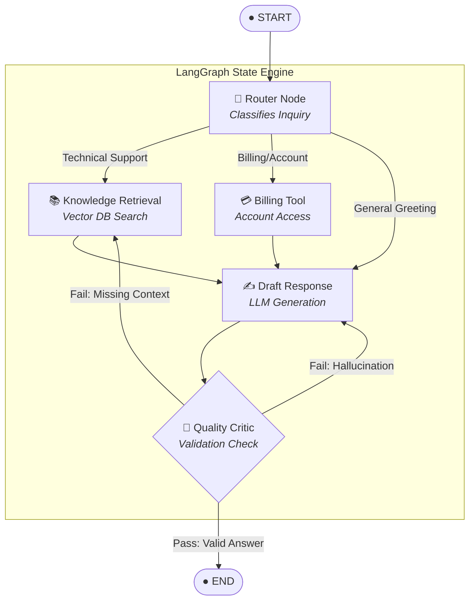

### `LangGraph` is a framework developed by LangChain to manage the control flow of applications that integrate an LLM.

## When should we use LangGraph?

When designing AI applications, we face the fundamental trade-off between control and freedom:

- **Freedom** gives your LLM more room to be creative and tackle unexpected problems.
- **Control** allows you to ensure predictable behavior and maintain guardrails.

Code agents in smolagents are very free, it can call multiple tools in a single action step, create their own tools. However, this behavior can make them less predictable and less controllable than a regular Agent working with JSON. In another words, the output might vary for the same query everytime.

`Langchain` shine when you need ""**Control**" over freedom.

Key scenarios where LangGraph excels include:
- Multi-step reasoning processes that need explicit control on the flow
- Applications requiring persistence of state between steps
- Systems that combine deterministic logic with AI capabilities
- Workflows that need human-in-the-loop interventions
- Complex agent architectures with multiple components working together

When you need to design a flow of actions based on the output of each action, and decide what to execute next accordingly, LangGraph is the correct framework.

LangGraph uses a directed graph structure to define the flow of your application:

- **Nodes** represent individual processing steps (like calling an LLM, using a tool, or making a decision)

- **Edges** define the possible transitions between steps

- **State** is user defined and maintained and passed between nodes during execution. When deciding which node to target next, this is the current state that we look at
